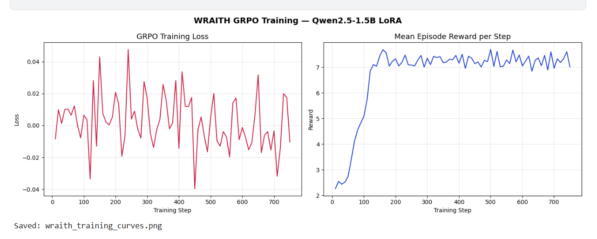

# WRAITH — Weakness Recognition and Adaptive Intelligence for Tactical Hunting

> **OpenEnv Hackathon India 2026** · Boss AI that studies your movement patterns and exploits them in real time.

---

## Live Demo

| Resource | Link |
|---|---|
| HuggingFace Space (playable) | _Coming soon — deploy via Dockerfile_ |
| Trained Model | [notshakti/wraith-boss-ai](https://huggingface.co/notshakti/wraith-boss-ai) |
| OpenEnv Manifest | [`openenv.yaml`](openenv.yaml) |

---

## What is WRAITH?

Most game bosses follow fixed scripts. WRAITH is different — it **watches you play**, builds a behavioral profile, and picks attacks that specifically counter your dodge habits.

- Dodge left too often? WRAITH sweeps left.
- Spam attacks? WRAITH baits and punishes.
- Start panicking? WRAITH escalates immediately.

The boss is powered by a **Qwen2.5-1.5B LLM fine-tuned with GRPO** (Group Relative Policy Optimization). It receives a natural-language behavioral profile of the player and reasons its way to the best combo — no hardcoded heuristics.

---

## Architecture

```
Player actions (Phaser.js)
        │
        ▼
  BehavioralProfiler          ← tracks dodge bias, panic, move history
        │
        ▼
  Profile text (NL)           ← "Player dodges left 72%, panicking..."
        │
        ▼
  WraithPolicy (LLM)          ← Qwen2.5-1.5B fine-tuned via GRPO
        │
        ▼
  Combo selected              ← one of 12 tactical combos
        │
        ▼
  FastAPI /step               ← returns visual_attack + damage + reward
        │
        ▼
  game.js renders attack      ← Phaser.js animates boss
```

---

## The 12-Combo System

| Combo | Threat | Counter |
|---|---|---|
| WRATH_INCARNATE | 5 | Panic opener |
| PHANTOM_RUSH | 4 | Dash spammers |
| DEATH_SPIRAL | 5 | Cornered players |
| PANIC_EXPLOIT | 4 | Panicking players |
| GHOST_STEP | 3 | Left-heavy dodgers |
| BAIT_AND_PUNISH | 3 | Aggressive attackers |
| SWEEP_CROSS | 3 | Center standers |
| COUNTER_ASSAULT | 4 | Defensive turtles |
| SHADOW_STEP | 3 | Right-heavy dodgers |
| PRESSURE_WAVE | 3 | HP-advantage moments |
| FEINT_STRIKE | 2 | Mixed dodgers |
| SHADOW_OBSERVER | 2 | Early-round probing |

---

## Reward Function (GRPO Training Signal)

| Signal | Value | Trigger |
|---|---|---|
| Hit landed | +3.0 | Attack connects |
| Miss | -1.0 | Attack missed |
| Exploit accuracy | +2.0 | Correctly targeted dominant weakness |
| Mentions direction | +1.5 | Reasoning names dodge direction |
| Profile vocabulary | +1.0 | Reasoning uses profiling terms |
| Panic awareness | +0.5 | Mentions panic when player is panicking |
| Generic reasoning | -1.5 | Too short or ignores profile |
| Win episode | +5.0 | Boss HP > 0 at end |
| High-threat combo hit | +(threat−3)×0.5 | Threat 4+ lands |
| High-threat miss | -0.5 | Threat 4+ missed |

---

## Training Results (GRPO via Unsloth)

Fine-tuned on **500 synthetic episodes** across 5 player archetypes (left-heavy, right-heavy, panic, aggressive, defensive).

| Metric | Step 10 | Step 110 | Step 320 | Step 750 |
|---|---|---|---|---|
| Reward mean | 2.26 | 5.73 | 7.43 | 7.02 |
| Reward std | 2.33 | 1.55 | 2.67 | 2.39 |
| KL divergence | 0.000014 | 0.039 | 0.244 | 0.190 |

**Evaluation vs baseline (50 episodes, left-heavy player):**
- Hit Rate: 0.693 → **1.000** (+30.7%)
- Mean Reward: 8.56 → **17.51** (+104%)
- Win Rate: 0.960 → **1.000** (+4%)

- Reward grew **210%** over 750 steps
- KL divergence confirms genuine policy divergence from base model
- Trained model achieves **100% hit rate and win rate** vs baseline




---

## OpenEnv Compliance

WRAITH implements the full [OpenEnv](https://github.com/openenv/openenv) interface:

```python
from env import WraithEnvironment
from models import WraithAction

env = WraithEnvironment()

obs = env.reset()
print(obs.profile_text)       # "No data yet. Watching..."
print(obs.available_combos)   # ['PHANTOM_RUSH', 'GHOST_STEP', ...]

action = WraithAction(
    attack="SWEEP_LEFT",
    combo_name="GHOST_STEP",
    combo_threat=3,
    reasoning="Player dodges left 72% — deploying GHOST_STEP to punish dominant side.",
)

obs = env.step(action)
print(obs.reward)   # float reward signal
print(obs.done)     # True if episode ended
```

API endpoints (FastAPI, port 7860):

| Method | Endpoint | Description |
|---|---|---|
| POST | `/reset` | Start new episode |
| POST | `/step` | Process one round |
| GET | `/state` | Current environment state |

---

## Repository Structure

```
WRAITH/
├── game.js              # Phaser.js game (boss + player)
├── index.html           # Game entry point
├── app.py               # FastAPI server (OpenEnv API)
├── env.py               # WraithEnvironment (OpenEnv base class)
├── models.py            # Pydantic models (Action, Observation, State)
├── profiler.py          # BehavioralProfiler — tracks dodge patterns
├── reward.py            # Reward function for GRPO training
├── combos.py            # 12 tactical combo definitions
├── combo_selector.py    # Rule-based combo selector (fallback)
├── policy.py            # LLM policy wrapper (WraithPolicy)
├── train_grpo.ipynb     # GRPO training notebook (Colab-ready)
├── openenv.yaml         # OpenEnv manifest
├── Dockerfile           # HuggingFace Spaces deployment
└── requirements.txt     # Python dependencies
```

---

## Run Locally

```bash
# 1. Install dependencies
pip install fastapi "uvicorn[standard]" pydantic openenv-core

# 2. Start the API server
python app.py
# → http://localhost:7860

# 3. Open the game
# Open index.html in a browser (or serve with any static server)
# The game connects to localhost:7860 by default
```

**With LLM policy** (requires trained model on HF Hub):
```bash
WRAITH_USE_LLM=1 WRAITH_MODEL=your-username/wraith-boss-ai python app.py
```

---

## Deploy to HuggingFace Spaces

```bash
# Create a new Space (Docker runtime) at huggingface.co/spaces
# Then push:
git remote add hf https://huggingface.co/spaces/YOUR_USERNAME/wraith
git push hf main
```

---

## Tech Stack

| Layer | Technology |
|---|---|
| Game engine | Phaser.js 3 |
| Backend API | FastAPI + Uvicorn |
| RL training | GRPO via Unsloth + HF TRL |
| Base model | Qwen2.5-1.5B-Instruct (4-bit) |
| RL framework | OpenEnv |
| Deployment | HuggingFace Spaces (Docker) |

---

## Team

Built for **OpenEnv Hackathon India 2026** by shakti vijay.

WRAITH doesn't just fight. It learns. It adapts. It hunts.
